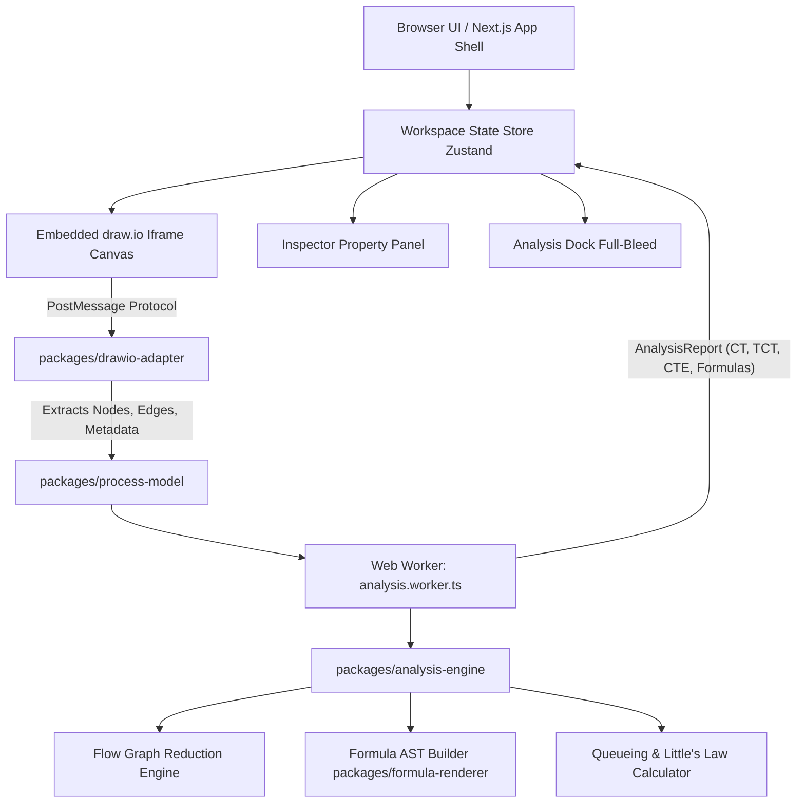
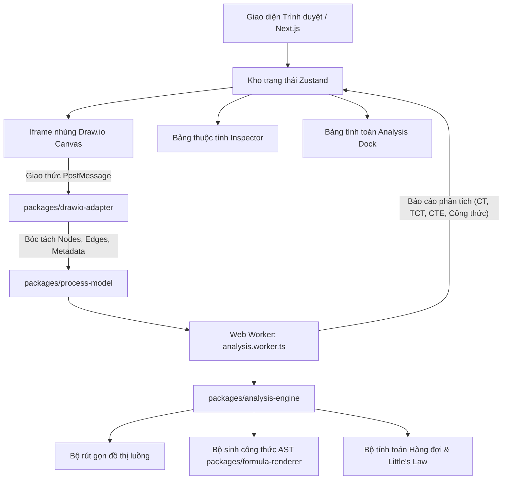

# ⚡ Flowculus

<p align="center">
  <strong>Interactive Business Process Modeling & Quantitative Cycle-Time Analysis Workspace</strong>
</p>

<p align="center">
  <a href="#-table-of-contents"></a>
  
  
  
  
  
</p>

---

## 📑 Table of Contents

- [English Documentation](#-english-documentation)
  - [Overview](#-overview)
  - [Key Features](#-key-features)
  - [Mathematical & Theoretical Foundation](#-mathematical--theoretical-foundation)
  - [System Architecture](#-system-architecture)
  - [Project & Monorepo Structure](#-project--monorepo-structure)
  - [Getting Started & Local Development](#-getting-started--local-development)
  - [Environment Variables](#-environment-variables)
  - [Available Scripts](#-available-scripts)
  - [Security & Privacy](#-security--privacy)
  - [License](#-license)
- [Tài Liệu Tiếng Việt (Vietnamese Documentation)](#-t%C3%A0i-li%E1%BB%87u-ti%E1%BA%BFng-vi%E1%BB%87t)
  - [Giới Thiệu Tổng Quan](#-gi%E1%BB%9Bi-thi%E1%BB%87u-t%E1%BB%95ng-quan)
  - [Các Tính Năng Nổi Bật](#-c%C3%A1c-t%C3%ADnh-n%C4%83ng-n%E1%BB%95i-b%E1%BA%ADt)
  - [Cơ Sở Lý Thuyết & Công Thức Toán Học](#-c%C6%A1-s%E1%BB%9F-l%C3%BD-thuy%E1%BA%BFt--c%C3%B4ng-th%E1%BB%A9c-to%C3%A1n-h%E1%BB%8Dc)
  - [Kiến Trúc Hệ Thống](#-ki%E1%BA%BFn-tr%C3%BAc-h%E1%BB%87-th%E1%BB%91ng)
  - [Cấu Trúc Dự Án Monorepo](#-c%E1%BA%A5u-tr%C3%BAc-d%E1%BB%B1-%C3%A1n-monorepo)
  - [Hướng Dẫn Cài Đặt & Chạy Cục Bộ](#-h%C6%B0%E1%BB%9Bng-d%E1%BA%ABn-c%C3%A0i-%C4%91%E1%BA%B7t--ch%E1%BA%A1y-c%E1%BB%A5c-b%E1%BB%99)
  - [Biến Môi Trường](#-bi%E1%BA%BFn-m%C3%B4i-tr%C6%B0%E1%BB%9Dng)
  - [Danh Sách Lệnh Thực Thi](#-danh-s%C3%A1ch-l%E1%BB%87nh-th%E1%BB%B1c-thi)
  - [Bảo Mật & Quyền Riêng Tư](#-b%E1%BA%A3o-m%E1%BA%ADt--quy%E1%BB%81n-ri%C3%AAng-t%C6%B0)
  - [Bản Quyền](#-b%E1%BA%A3n-quy%E1%BB%81n)

---

# 🌐 English Documentation

## 🌟 Overview

**Flowculus** is a browser-first, zero-backend process modeling workspace engineered for business process design, capacity planning, and quantitative flow analysis.

It seamlessly embeds the industry-standard **draw.io** diagram editor into a high-performance React application shell, allowing users to visually sketch process flowcharts while an isolated background Web Worker engine automatically calculates:

- **Cycle Time ($CT$)**
- **Theoretical Cycle Time ($TCT$)**
- **Cycle-Time Efficiency ($CTE$)**
- **Cost per Execution**
- **Little's Law Capacity & $M/M/c$ Multi-Server Queueing Metrics**
- **Critical Path Analysis & Path Traversal Counts**

All custom attributes and calculations are stored natively inside standard `.drawio` XML files and `.flowculus.json` schemas, ensuring 100% interoperability with native diagrams.net desktop and web versions.

---

## 🚀 Key Features

| Feature                           | Description                                                                                                     |
| :-------------------------------- | :-------------------------------------------------------------------------------------------------------------- |
| **🎨 Embedded draw.io Canvas**    | Full-featured native diagramming with BPMN 2.0 stencils, rich shapes, connectors, and multi-page tabs.          |
| **⚡ Real-Time Math Engine**      | Instant calculation in a background Web Worker with symbolic formula AST generation.                            |
| **📐 Full-Bleed Docked Panel**    | Edge-to-edge calculation drawer with clear 4-KPI summary, formula breakdowns, and queueing simulators.          |
| **📑 Multi-Page / Tab Support**   | Switch between multiple process diagram pages seamlessly; calculates active page metrics instantly.             |
| **📊 Little's Law & Queueing**    | Scenario simulation for arrival rate $\lambda$, Work In Process (WIP) $L$, and $M/M/c$ multi-server queues.     |
| **📤 Multi-Format Export**        | Export as `.drawio` XML, `.flowculus.json`, CSV table, high-res PNG/SVG, and print-ready PDF executive reports. |
| **🌓 Theme & Localization**       | Instant Dark/Light mode switching and English / Vietnamese (VI/EN) bilingual support.                           |
| **🔒 100% Private & Client-Side** | Zero telemetry, zero server-side storage. Drafts persist securely in local IndexedDB.                           |

---

## 🧮 Mathematical & Theoretical Foundation

Flowculus strictly implements the quantitative flow analysis equations documented in standard Business Process Management literature (_Fundamentals of Business Process Management_, 2nd ed., Dumas et al., Chapter 7: Flow Analysis):

### 1. Sequence Pattern

For tasks executed sequentially:
$$CT = \sum_{i=1}^n T_i = T_1 + T_2 + \dots + T_n$$

### 2. Exclusive Choice Pattern (XOR Split / Join)

For mutually exclusive branches with probabilities $p_i$ ($\sum p_i = 1$):
$$CT = \sum_{i=1}^n (p_i \times CT_i) = p_1 CT_1 + p_2 CT_2 + \dots + p_n CT_n$$

### 3. Parallel Pattern (AND Split / Join)

For concurrent branches executing in parallel:
$$CT = \max(CT_1, CT_2, \dots, CT_n)$$
$$\text{Cost} = \sum_{i=1}^n \text{Cost}_i \quad (\text{all parallel tasks incur labor and resource costs})$$

### 4. Rework Loop Pattern

For an activity with rework probability $r$ ($0 \le r < 1$):
$$CT = \frac{T}{1 - r}$$

### 5. Theoretical Cycle Time ($TCT$) & Cycle-Time Efficiency ($CTE$)

$TCT$ is the pure processing time with zero waiting / queueing delay:
$$CTE = \frac{TCT}{CT} \times 100\%$$

### 6. Little's Law & Queueing Theory

- **Little's Law**: $L = \lambda \times W \implies CT = \frac{\text{WIP}}{\lambda}$
- **Traffic Intensity / Utilization**: $\rho = \frac{\lambda}{c \mu}$
- **Average Waiting Time in Queue**: $W_q$ via Erlang-C distribution.

---

## 🏗 System Architecture



---

## 📦 Project & Monorepo Structure

```text
Flowculus/
├── apps/
│   └── web/                     # Next.js 16 App Router application shell
│       ├── app/                 # Layout, metadata, global styles (globals.css)
│       ├── components/          # React components (AnalysisDock, Header, Inspector, etc.)
│       ├── lib/                 # State store, i18n, drawio-model parser, worker hooks
│       ├── public/              # Static branding assets (logo.svg, favicon.svg)
│       └── workers/             # Dedicated analysis Web Worker
├── packages/
│   ├── analysis-engine/         # Core graph reduction, cycle time & cost algorithms
│   ├── drawio-adapter/          # Draw.io embed protocol, XML serialization, multi-page tabs
│   ├── file-formats/            # CSV, Flowculus JSON, and draw.io XML import/export
│   ├── formula-renderer/        # Formula AST generation and mathematical string formatting
│   ├── process-model/           # TypeScript interfaces, schemas & BPMN domain types
│   └── validation/              # Process graph sanity and validation checks
├── docs/                        # Architecture Decision Records (ADRs) & documentation
├── .env.example                 # Environment variables template
├── .env.dev                     # Development environment overrides
├── .env.pro                     # Production environment overrides
├── turbo.json                   # Turborepo pipeline configuration
└── package.json                 # Workspace root package definition
```

---

## 💻 Getting Started & Local Development

### Prerequisites

- **Node.js**: `v20.9.0` or higher
- **pnpm**: `v11.x` (managed via Corepack)

### Installation & Setup

```bash
# 1. Clone the repository
git clone https://github.com/your-username/Flowculus.git
cd Flowculus

# 2. Enable Corepack & install dependencies
corepack enable
pnpm install

# 3. Copy environment configuration
cp .env.example .env.local

# 4. Start development server
pnpm dev
```

Open [http://localhost:3000](http://localhost:3000) in your browser to launch the Flowculus workspace.

---

## 🔑 Environment Variables

| Variable                       | Default Value                                                                             | Description                                                          |
| :----------------------------- | :---------------------------------------------------------------------------------------- | :------------------------------------------------------------------- |
| `NEXT_PUBLIC_DRAWIO_EMBED_URL` | `https://embed.diagrams.net/?embed=1&proto=json&libraries=0&noExitBtn=1&exportProtocol=1` | Draw.io embed endpoint. Can be overridden for self-hosted instances. |

See `.env.example`, `.env.dev`, and `.env.pro` for details.

---

## 🛠 Available Scripts

In the repository root, you can run:

```bash
# Start development server (default)
pnpm dev

# Start development server with .env.dev
pnpm dev:dev

# Start development server with .env.pro
pnpm dev:pro

# Run unit tests across all packages (48 tests)
pnpm test

# Type-check all packages with TypeScript
pnpm typecheck

# Lint codebase with ESLint
pnpm lint

# Format code with Prettier
pnpm format

# Verify formatting
pnpm format:check

# Production build (default)
pnpm build

# Production build with .env.pro
pnpm build:pro

# Start production server with .env.pro
pnpm start:pro
```

---

## 🔒 Security & Privacy

- **Zero Remote Telemetry**: Flowculus does not collect or transmit user process models, business data, or calculation results to external servers.
- **Strict Origin Validation**: All cross-origin `postMessage` communications with embedded draw.io are strictly verified against the configured `DRAWIO_ORIGIN`.
- **Local Persistence**: Drafts are stored locally in the user's browser using `IndexedDB`.

---

## 📄 License

Distributed under the **MIT License**.

---

# 🇻🇳 Tài Liệu Tiếng Việt

## 🌟 Giới Thiệu Tổng Quan

**Flowculus** là không gian làm việc mô hình hóa quy trình kinh doanh và phân tích định lượng thời gian chu trình (Cycle Time) chạy trực tiếp trên trình duyệt, không cần máy chủ backend.

Flowculus tích hợp trực tiếp trình vẽ **draw.io** chuẩn công nghiệp vào khung ứng dụng React hiệu năng cao. Trong khi người dùng thao tác vẽ sơ đồ luồng quy trình, bộ công cụ tính toán chạy ngầm trong Web Worker sẽ tự động bóc tách và tính toán:

- **Thời gian chu trình ($CT - \text{Cycle Time}$)**
- **Thời gian lý thuyết ($TCT - \text{Theoretical Cycle Time}$)**
- **Hiệu suất chu trình ($CTE - \text{Cycle-Time Efficiency}$)**
- **Chi phí cho mỗi lượt thực thi ($\text{Cost / Execution}$)**
- **Năng lực hệ thống theo Định luật Little & Mô hình hàng đợi đa kênh $M/M/c$**
- **Phân tích đường găng (Critical Path) & Đếm số lượng đường đi qua quy trình**

Toàn bộ thuộc tính ngữ nghĩa và thông số tính toán được lưu trữ trực tiếp bên trong cấu trúc XML của tệp `.drawio` và lược đồ JSON `.flowculus.json`, đảm bảo tương thích 100% với các phiên bản Draw.io / diagrams.net trên máy tính lẫn nền tảng web.

---

## 🚀 Các Tính Năng Nổi Bật

| Tính năng                               | Mô tả chi tiết                                                                                                                             |
| :-------------------------------------- | :----------------------------------------------------------------------------------------------------------------------------------------- |
| **🎨 Canvas Draw.io Nhúng**             | Vẽ sơ đồ quy trình hoàn chỉnh với đầy đủ bộ ký hiệu BPMN 2.0, hình khối, đường nối thông minh và hỗ trợ nhiều trang (Multi-page tabs).     |
| **⚡ Bộ Tính Toán Thời Gian Thực**      | Xử lý tính toán tức thời trong Web Worker ngầm, tự động sinh cây cú pháp trừu tượng (AST) và hiển thị công thức đại số toán học.           |
| **📐 Bảng Phân Tích Tràn Viền**         | Bảng tính toán phẳng tràn viền 100% ở đáy màn hình, hiển thị trực quan 4 thẻ chỉ số KPI chính, chi tiết công thức và các cảnh báo.         |
| **📑 Hỗ Trợ Nhiều Tab / Trang**         | Chuyển đổi linh hoạt giữa nhiều trang sơ đồ quy trình trong cùng một tệp; tự động tính toán chính xác theo trang hiện hành.                |
| **📊 Định Luật Little & Hàng Đợi**      | Mô phỏng kịch bản vận hành với tốc độ đến $\lambda$, lượng công việc dở dang ($WIP$) $L$, và hệ thống hàng đợi nhiều kênh phục vụ $M/M/c$. |
| **📤 Xuất Dữ Liệu Đa Định Dạng**        | Hỗ trợ xuất tệp `.drawio` XML, JSON, bảng dữ liệu CSV, ảnh chất lượng cao PNG/SVG và tệp báo cáo PDF hoàn chỉnh để in ấn.                  |
| **🌓 Đổi Theme & Song Ngữ**             | Chuyển đổi nhanh chóng giữa chế độ Sáng/Tối (Light/Dark) và song ngữ Tiếng Việt / Tiếng Anh (VI/EN).                                       |
| **🔒 Riêng Tư & Chạy Phía Client 100%** | Hoàn toàn không gửi dữ liệu ra máy chủ ngoài. Bản nháp được lưu trữ bảo mật cục bộ trên trình duyệt qua IndexedDB.                         |

---

## 🧮 Cơ Sở Lý Thuyết & Công Thức Toán Học

Hệ thống áp dụng chuẩn xác các công thức Flow Analysis theo tài liệu lý thuyết Quản trị quy trình kinh doanh (_Fundamentals of Business Process Management_, Dumas et al., Chương 7):

### 1. Khối công việc tuần tự (Sequence Pattern)

Đối với các công việc thực hiện nối tiếp nhau:
$$CT = \sum_{i=1}^n T_i = T_1 + T_2 + \dots + T_n$$

### 2. Khối rẽ nhánh lựa chọn loại trừ (XOR Split / Join)

Đối với các nhánh rẽ có điều kiện loại trừ với xác suất $p_i$ ($\sum p_i = 1$):
$$CT = \sum_{i=1}^n (p_i \times CT_i) = p_1 CT_1 + p_2 CT_2 + \dots + p_n CT_n$$

### 3. Khối rẽ nhánh song song (AND Split / Join)

Đối với các nhánh công việc thực hiện đồng thời cùng lúc:
$$CT = \max(CT_1, CT_2, \dots, CT_n)$$
$$\text{Cost} = \sum_{i=1}^n \text{Cost}_i \quad (\text{tất cả các nhánh song song đều tiêu tốn chi phí nhân công và tài nguyên})$$

### 4. Khối lặp / Làm lại (Rework Loop Pattern)

Đối với công việc có xác suất phải làm lại là $r$ ($0 \le r < 1$):
$$CT = \frac{T}{1 - r}$$

### 5. Thời gian lý thuyết ($TCT$) & Hiệu suất chu trình ($CTE$)

$TCT$ là thời gian xử lý thực tế thuần túy (loại bỏ hoàn toàn thời gian chờ và xếp hàng):
$$CTE = \frac{TCT}{CT} \times 100\%$$

### 6. Định luật Little & Lý thuyết hàng đợi

- **Định luật Little**: $L = \lambda \times W \implies CT = \frac{\text{WIP}}{\lambda}$
- **Hệ số sử dụng (Traffic Intensity)**: $\rho = \frac{\lambda}{c \mu}$
- **Thời gian chờ trung bình trong hàng đợi**: $W_q$ tính toán qua phân phối Erlang-C.

---

## 🏗 Kiến Trúc Hệ Thống



---

## 📦 Cấu Trúc Dự Án Monorepo

```text
Flowculus/
├── apps/
│   └── web/                     # Ứng dụng Next.js 16 App Router chính
│       ├── app/                 # Bố cục giao diện, metadata, global styles (globals.css)
│       ├── components/          # Các thành phần React (AnalysisDock, Header, Inspector, v.v.)
│       ├── lib/                 # Store trạng thái, i18n, bộ phân tích drawio-model, worker hooks
│       ├── public/              # Logo nhận diện và biểu tượng (logo.svg, favicon.svg)
│       └── workers/             # Web Worker chạy thuật toán phân tích ngầm
├── packages/
│   ├── analysis-engine/         # Thuật toán cốt lõi tính toán thời gian chu trình, chi phí & rút gọn luồng
│   ├── drawio-adapter/          # Giao thức nhúng Draw.io, đồng bộ XML và hỗ trợ nhiều trang
│   ├── file-formats/            # Bộ chuyển đổi nhập/xuất file CSV, Flowculus JSON và Draw.io XML
│   ├── formula-renderer/        # Bộ sinh cây AST và định dạng công thức toán học
│   ├── process-model/           # Định nghĩa kiểu dữ liệu TypeScript, lược đồ BPMN
│   └── validation/              # Bộ kiểm tra tính hợp lệ và cấu trúc logic của đồ thị quy trình
├── docs/                        # Tài liệu kiến trúc và quyết định thiết kế (ADRs)
├── .env.example                 # Mẫu cấu hình biến môi trường
├── .env.dev                     # Cấu hình môi trường phát triển
├── .env.pro                     # Cấu hình môi trường production
├── turbo.json                   # Cấu hình Turborepo pipeline
└── package.json                 # Định nghĩa gói và kịch bản thực thi ở thư mục gốc
```

---

## 💻 Hướng Dẫn Cài Đặt & Chạy Cục Bộ

### Yêu cầu hệ thống

- **Node.js**: Phiên bản `>= 20.9.0`
- **pnpm**: Phiên bản `11.x` (quản lý qua Corepack)

### Các bước thực hiện

```bash
# 1. Clone mã nguồn
git clone https://github.com/your-username/Flowculus.git
cd Flowculus

# 2. Kích hoạt Corepack và cài đặt dependencies
corepack enable
pnpm install

# 3. Tạo tệp cấu hình môi trường cục bộ
cp .env.example .env.local

# 4. Khởi động môi trường phát triển
pnpm dev
```

Truy cập [http://localhost:3000](http://localhost:3000) trên trình duyệt để bắt đầu sử dụng Flowculus.

---

## 🔑 Biến Môi Trường

| Tên biến                       | Giá trị mặc định                                                                          | Ý nghĩa & Mô tả                                                             |
| :----------------------------- | :---------------------------------------------------------------------------------------- | :-------------------------------------------------------------------------- |
| `NEXT_PUBLIC_DRAWIO_EMBED_URL` | `https://embed.diagrams.net/?embed=1&proto=json&libraries=0&noExitBtn=1&exportProtocol=1` | Đường dẫn máy chủ nhúng Draw.io. Có thể thay đổi nếu tự host Draw.io riêng. |

Xem thêm chi tiết tại `.env.example`, `.env.dev` và `.env.pro`.

---

## 🛠 Danh Sách Lệnh Thực Thi

Tại thư mục gốc của dự án, bạn có thể sử dụng các lệnh sau:

```bash
# Khởi động môi trường phát triển (Mặc định)
pnpm dev

# Khởi động với file môi trường .env.dev
pnpm dev:dev

# Khởi động với file môi trường .env.pro
pnpm dev:pro

# Chạy toàn bộ bộ kiểm thử tự động (48 test cases)
pnpm test

# Kiểm tra kiểu tĩnh với TypeScript trên toàn bộ packages
pnpm typecheck

# Kiểm tra chuẩn mã nguồn với ESLint
pnpm lint

# Tự động định dạng mã nguồn với Prettier
pnpm format

# Kiểm tra định dạng mã nguồn
pnpm format:check

# Đóng gói bản Production (Mặc định)
pnpm build

# Đóng gói bản Production với cấu hình .env.pro
pnpm build:pro

# Khởi chạy server Production với cấu hình .env.pro
pnpm start:pro
```

---

## 🔒 Bảo Mật & Quyền Riêng Tư

- **Không Thu Thập Dữ Liệu Từ Xa**: Flowculus không gửi bất kỳ dữ liệu sơ đồ quy trình hay kết quả tính toán nào của người dùng về máy chủ bên ngoài.
- **Kiểm Soát Nguồn Iframe Nghiêm Ngặt**: Mọi tin nhắn giao tiếp qua `postMessage` với Draw.io đều được đối chiếu và xác thực theo `DRAWIO_ORIGIN`.
- **Lưu Trữ Cục Bộ Trực Tiếp**: Bản nháp và lịch sử chỉnh sửa được lưu an toàn trực tiếp trên trình duyệt của người dùng thông qua `IndexedDB`.

---

## 📄 Bản Quyền

Phát hành theo giấy phép mã nguồn mở **MIT License**.
