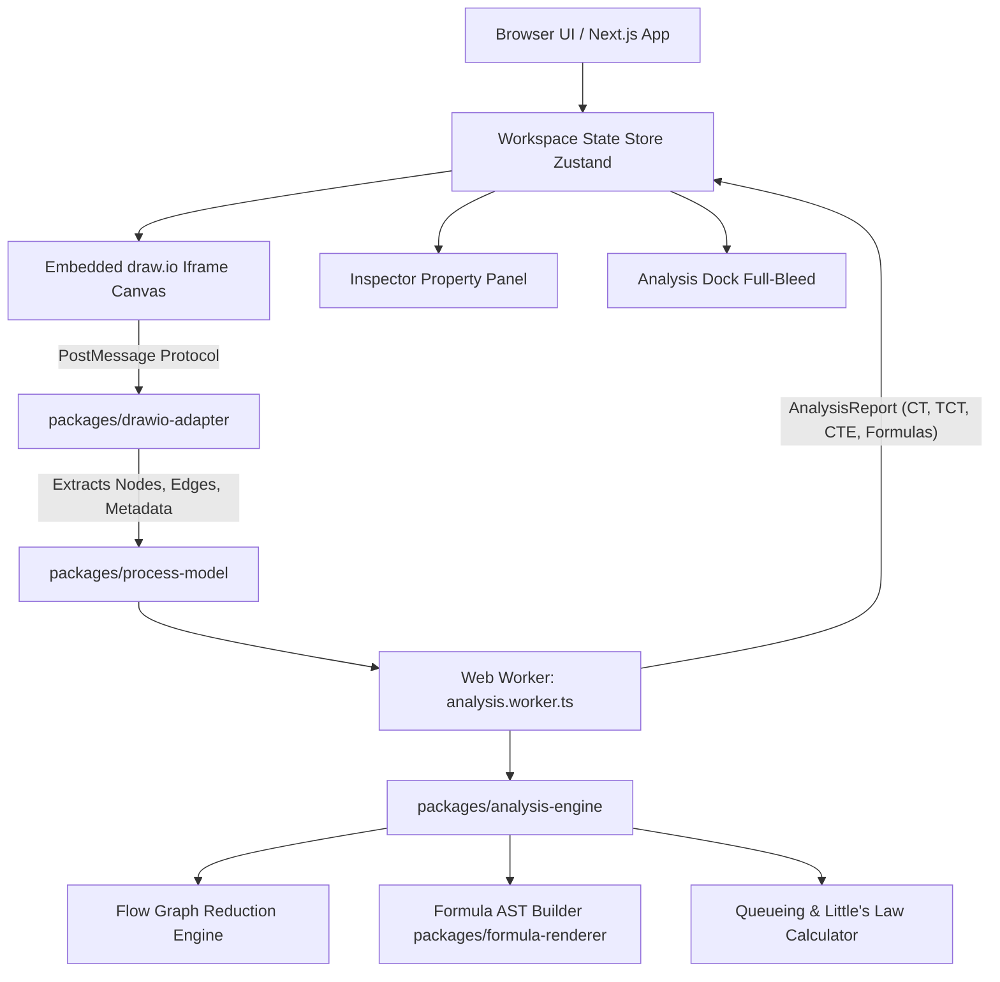

# ⚡ Flowculus

<p align="center">
  
</p>

<p align="center">
  <strong>Interactive Business Process Modeling & Quantitative Cycle-Time Workspace</strong><br>
  <em>Draw the flow. Let the math do the sweating.</em>
</p>

<p align="center">
  <a href="#-table-of-contents"></a>
  
  
  
  
  
</p>

---

## 📑 Table of Contents

- [English Documentation](#-english-documentation)
  - [Overview](#-overview)
  - [Key Features](#-key-features)
  - [Mathematical & Theoretical Foundation](#-mathematical--theoretical-foundation)
  - [System Architecture](#-system-architecture)
  - [Project & Monorepo Structure](#-project--monorepo-structure)
  - [Getting Started & Local Development](#-getting-started--local-development)
  - [Environment Variables](#-environment-variables)
  - [Available Scripts](#-available-scripts)
  - [Deployment on Vercel](#-deployment-on-vercel)
  - [Security & Privacy](#-security--privacy)
- [Tài Liệu Tiếng Việt (Vietnamese)](#-t%C3%A0i-li%E1%BB%87u-ti%E1%BA%BFng-vi%E1%BB%87t)
  - [Giới Thiệu Tổng Quan](#-gi%E1%BB%9Bi-thi%E1%BB%87u-t%E1%BB%95ng-quan)
  - [Các Tính Năng Nổi Bật](#-c%C3%A1c-t%C3%ADnh-n%C4%83ng-n%E1%BB%95i-b%E1%BA%ADt)
  - [Cơ Sở Lý Thuyết & Công Thức Toán Học](#-c%C6%A1-s%E1%BB%9F-l%C3%BD-thuy%E1%BA%BFt--c%C3%B4ng-th%E1%BB%A9c-to%C3%A1n-h%E1%BB%8Dc)
  - [Hướng Dẫn Cài Đặt & Chạy Cục Bộ](#-h%C6%B0%E1%BB%9Bng-d%E1%BA%ABn-c%C3%A0i-%C4%91%E1%BA%B7t--ch%E1%BA%A1y-c%E1%BB%A5c-b%E1%BB%99)
  - [Hướng Dẫn Triển Khai Vercel](#-h%C6%B0%E1%BB%9Bng-d%E1%BA%ABn-tri%E1%BB%83n-khai-l%C3%AAn-vercel)

---

# 🌐 English Documentation

## 🌟 Overview

**Flowculus** is a browser-first, zero-backend process modeling workspace engineered for Enterprise Resource Planning (ERP), Business Process Management (BPM), and Operations Research courses (such as **IS6003 — Enterprise Resource Planning**).

It seamlessly embeds the industry-standard **draw.io** diagram editor into a high-performance React application shell, allowing users to visually sketch process flowcharts while an isolated Web Worker engine automatically calculates:

- **Cycle Time ($CT$)**
- **Theoretical Cycle Time ($TCT$)**
- **Cycle-Time Efficiency ($CTE$)**
- **Cost per Execution**
- **Little's Law Capacity & $M/M/c$ Queueing Metrics**
- **Critical Path Analysis & Path Traversal Counts**

All custom attributes and calculations are stored natively inside `.drawio` XML files and `.flowculus.json` schemas, ensuring 100% interoperability with native diagrams.net desktop and web versions.

---

## 🚀 Key Features

| Feature                           | Description                                                                                                     |
| :-------------------------------- | :-------------------------------------------------------------------------------------------------------------- |
| **🎨 Embedded draw.io Canvas**    | Full-featured native diagramming with BPMN 2.0 stencils, rich shapes, connectors, and multi-page tabs.          |
| **⚡ Real-Time Math Engine**      | Instant calculation in a background Web Worker with symbolic formula AST generation.                            |
| **📐 Full-Bleed Docked Panel**    | Edge-to-edge calculation drawer with clear 4-KPI summary, formula breakdowns, and queueing simulators.          |
| **📑 Multi-Page / Tab Support**   | Switch between multiple process diagram pages seamlessly; calculates active page metrics instantly.             |
| **📊 Little's Law & Queueing**    | Scenario simulation for arrival rate $\lambda$, Work In Process (WIP) $L$, and $M/M/c$ multi-server queues.     |
| **📤 Multi-Format Export**        | Export as `.drawio` XML, `.flowculus.json`, CSV table, high-res PNG/SVG, and print-ready PDF executive reports. |
| **🌓 Theme & Localization**       | Instant Dark/Light mode switching and English / Vietnamese (VI/EN) bilingual support.                           |
| **🔒 100% Private & Client-Side** | Zero telemetry, zero server-side storage. Drafts persist securely in local IndexedDB.                           |

---

## 🧮 Mathematical & Theoretical Foundation

Flowculus strictly implements the quantitative flow analysis equations documented in standard Business Process Management literature (_Fundamentals of Business Process Management_, 2nd ed., Dumas et al., Chapter 7: Flow Analysis):

### 1. Sequence Pattern (Tuần tự)

For tasks executed sequentially:
$$CT = \sum_{i=1}^n T_i = T_1 + T_2 + \dots + T_n$$

### 2. Exclusive Choice Pattern (XOR Split / Join)

For mutually exclusive branches with probabilities $p_i$ ($\sum p_i = 1$):
$$CT = \sum_{i=1}^n (p_i \times CT_i) = p_1 CT_1 + p_2 CT_2 + \dots + p_n CT_n$$

### 3. Parallel Pattern (AND Split / Join)

For concurrent branches executing in parallel:
$$CT = \max(CT_1, CT_2, \dots, CT_n)$$
$$\text{Cost} = \sum_{i=1}^n \text{Cost}_i \quad (\text{all parallel tasks incur labor and resource costs})$$

### 4. Rework Loop Pattern (Lặp / Làm lại)

For an activity with rework probability $r$ ($0 \le r < 1$):
$$CT = \frac{T}{1 - r}$$

### 5. Theoretical Cycle Time ($TCT$) & Efficiency ($CTE$)

$TCT$ is the pure processing time with zero waiting / queueing delay:
$$CTE = \frac{TCT}{CT} \times 100\%$$

### 6. Little's Law & Queueing Theory

- **Little's Law**: $L = \lambda \times W \implies CT = \frac{\text{WIP}}{\lambda}$
- **Traffic Intensity / Utilization**: $\rho = \frac{\lambda}{c \mu}$
- **Average Waiting Time in Queue**: $W_q$ via Erlang-C distribution.

---

## 🏗 System Architecture



---

## 📦 Project & Monorepo Structure

```text
Flowculus/
├── apps/
│   └── web/                     # Next.js 16 App Router application shell
│       ├── app/                 # Layout, metadata, global styles (globals.css)
│       ├── components/          # React components (AnalysisDock, Header, Inspector, etc.)
│       ├── lib/                 # State store, i18n, drawio-model parser, worker hooks
│       ├── public/              # Static branding logos (logo.svg, logo-vi.svg, favicon)
│       └── workers/             # Dedicated analysis Web Worker
├── packages/
│   ├── analysis-engine/         # Core graph reduction, cycle time & cost algorithms
│   ├── drawio-adapter/          # Draw.io embed protocol, XML serialization, multi-page tabs
│   ├── file-formats/            # CSV, Flowculus JSON, and draw.io XML import/export
│   ├── formula-renderer/        # Formula AST generation and mathematical string formatting
│   ├── process-model/           # TypeScript interfaces, schemas & BPMN domain types
│   └── validation/              # Process graph sanity and validation checks
├── docs/                        # Architecture Decision Records (ADRs) & documentation
├── .env.example                 # Environment variables template
├── turbo.json                   # Turborepo pipeline configuration
├── vercel.json                  # Vercel deployment configuration
└── package.json                 # Workspace root package definition
```

---

## 💻 Getting Started & Local Development

### Prerequisites

- **Node.js**: `v20.9.0` or higher
- **pnpm**: `v11.x` (managed via Corepack)

### Installation & Setup

```bash
# 1. Clone the repository
git clone https://github.com/your-username/Flowculus.git
cd Flowculus

# 2. Enable Corepack & install dependencies
corepack enable
pnpm install

# 3. Copy environment configuration
cp .env.example .env.local

# 4. Start development server
pnpm dev
```

Open [http://localhost:3000](http://localhost:3000) in your browser to launch the Flowculus workspace.

---

## 🔑 Environment Variables

| Variable                       | Default Value                                                                             | Description                                                          |
| :----------------------------- | :---------------------------------------------------------------------------------------- | :------------------------------------------------------------------- |
| `NEXT_PUBLIC_DRAWIO_EMBED_URL` | `https://embed.diagrams.net/?embed=1&proto=json&libraries=0&noExitBtn=1&exportProtocol=1` | Draw.io embed endpoint. Can be overridden for self-hosted instances. |

See `.env.example` for details.

---

## 🛠 Available Scripts

In the repository root, you can run:

```bash
# Start development server (default)
pnpm dev

# Start development server with .env.dev
pnpm dev:dev

# Start development server with .env.pro
pnpm dev:pro

# Run unit tests across all packages (48 tests)
pnpm test

# Type-check all packages with TypeScript
pnpm typecheck

# Lint codebase with ESLint
pnpm lint

# Format code with Prettier
pnpm format

# Verify formatting
pnpm format:check

# Production build (default)
pnpm build

# Production build with .env.pro
pnpm build:pro

# Start production server with .env.pro
pnpm start:pro
```

---

## 🚀 Deployment on Vercel

Flowculus is pre-configured with `vercel.json` for 1-click deployment on **Vercel**:

1. Push your code to GitHub / GitLab / Bitbucket.
2. Import the project in Vercel.
3. Configure the build settings:
   - **Framework Preset**: `Next.js`
   - **Root Directory**: `./` (leave default)
   - **Build Command**: `pnpm build`
   - **Output Directory**: `apps/web/.next`
   - **Install Command**: `pnpm install`
4. Click **Deploy**.

---

## 🔒 Security & Privacy

- **No Remote Telemetry**: Flowculus does not collect or transmit user process models or calculation data to external servers.
- **Strict Iframe Message Origin Validation**: All cross-origin `postMessage` communications with embedded draw.io are verified against the configured `DRAWIO_ORIGIN`.
- **Local Persistence**: Drafts are stored locally in the user's browser using `IndexedDB`.

---

# 🇻🇳 Tài Liệu Tiếng Việt

## 📖 Giới Thiệu Tổng Quan

**Flowculus** là không gian làm việc mô hình hóa quy trình kinh doanh và phân tích định lượng thời gian chu trình (Cycle Time) chạy trực tiếp trên trình duyệt, không cần máy chủ backend. Ứng dụng được thiết kế phục vụ môn học **Hoạch định nguồn lực doanh nghiệp (IS6003)** và quản trị quy trình kinh doanh (BPM).

Flowculus tích hợp trực tiếp trình vẽ **draw.io** chuẩn công nghiệp, kết hợp với bộ tính toán toán học chạy ngầm trong Web Worker để tự động xuất ra công thức đại số và tính toán các chỉ số hiệu năng theo thời gian thực.

---

## 🎯 Các Tính Năng Nổi Bật

1. **Vẽ sơ đồ trực quan với Draw.io nhúng**: Hỗ trợ đầy đủ bộ ký hiệu BPMN 2.0, các cổng rẽ nhánh (Gateway), công việc (Task), sự kiện (Event), và hỗ trợ nhiều trang (Multi-page tabs).
2. **Tính toán tức thời & hiển thị công thức đại số**: Tự động sinh công thức chi tiết cho $CT, TCT, CTE, \text{Cost}$ dưới dạng công thức toán học sắc nét.
3. **Bảng phân tích tràn viền (Full-Bleed Dock)**: Giao diện bảng tính toán phẳng gắn liền ở đáy màn hình, hiển thị 4 thẻ KPI lớn, phân bổ công thức và cảnh báo khoa học.
4. **Mô phỏng hàng đợi & Định luật Little**: Tính toán năng lực phục vụ, $WIP$, thời gian chờ trong hàng đợi theo mô hình $M/M/1$ và $M/M/c$.
5. **Xuất báo cáo đa định dạng**: Xuất file `.drawio` XML, file JSON, bảng CSV, ảnh PNG/SVG chất lượng cao và báo cáo PDF đầy đủ cho giảng viên/doanh nghiệp.
6. **Hỗ trợ Song ngữ & Giao diện Sáng/Tối**: Chuyển đổi nhanh Tiếng Việt / Tiếng Anh và Dark/Light mode mượt mà.

---

## 📐 Cơ Sở Lý Thuyết & Công Thức Toán Học

Hệ thống áp dụng chính xác các công thức Flow Analysis trong giáo trình _Fundamentals of Business Process Management_ (Dumas et al., Chương 7):

1. **Khối tuần tự (Sequence)**:
   $$CT = \sum_{i=1}^n T_i$$
2. **Khối rẽ nhánh lựa chọn (XOR Split / Join)**:
   $$CT = \sum_{i=1}^n (p_i \times CT_i) \quad \text{với } \sum p_i = 1$$
3. **Khối rẽ nhánh song song (AND Split / Join)**:
   $$CT = \max(CT_1, CT_2, \dots, CT_n)$$
   $$\text{Cost} = \sum_{i=1}^n \text{Cost}_i$$
4. **Khối lặp / làm lại (Rework Loop)**:
   $$CT = \frac{T}{1 - r} \quad (r: \text{xác suất làm lại})$$
5. **Hiệu suất chu trình (Cycle-Time Efficiency - CTE)**:
   $$CTE = \frac{TCT}{CT} \times 100\% \quad (TCT: \text{thời gian xử lý thực, loại bỏ thời gian chờ})$$

---

## 💻 Hướng Dẫn Cài Đặt & Chạy Cục Bộ

### Yêu cầu hệ thống

- **Node.js**: Phiên bản `>= 20.9.0`
- **pnpm**: Phiên bản `11.x`

### Các bước thực hiện

```bash
# 1. Clone mã nguồn
git clone https://github.com/your-username/Flowculus.git
cd Flowculus

# 2. Bật Corepack và cài đặt thư viện
corepack enable
pnpm install

# 3. Chạy môi trường phát triển (Mặc định)
pnpm dev

# Chạy với file môi trường .env.dev
pnpm dev:dev

# Chạy với file môi trường .env.pro
pnpm dev:pro

# Build và chạy thử bản Production với .env.pro
pnpm build:pro
pnpm start:pro
```

Truy cập [http://localhost:3000](http://localhost:3000) trên trình duyệt để sử dụng ứng dụng.

---

## ☁️ Hướng Dẫn Triển Khai Lên Vercel

1. Đẩy mã nguồn lên kho lưu trữ GitHub / GitLab.
2. Đăng nhập vào [Vercel](https://vercel.com) và chọn **Add New Project**.
3. Chọn repository `Flowculus`.
4. Vercel sẽ tự động nhận diện cấu hình từ `vercel.json`:
   - **Framework**: Next.js
   - **Build Command**: `pnpm build`
   - **Output Directory**: `apps/web/.next`
5. Nhấn **Deploy** để hoàn tất triển khai.

---

## 📄 Bản Quyền & Giấy Phép

Dự án được phân phối dưới giấy phép **MIT License**. Phục vụ mục đích học tập và nghiên cứu môn học IS6003 — Hoạch định nguồn lực doanh nghiệp.
